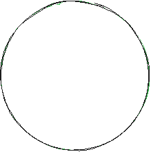
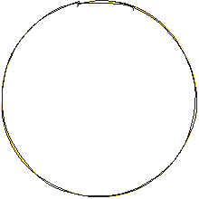
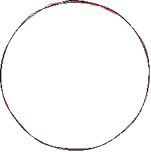

> SOFTWARE REQUIREMENTS SPECIFICATION (SRS)

**Проект:** **Система** **визуализации** **физических** **свойств**
**бетона** **(Stage** **1)**

> **Версия** **документа:** 1.0.0
>
> **Статус:** Approved for Development
>
> **Дата:** 02 февраля 2026 г.
>
> **Подготовлено:**
>
> **Project** **Manager:** Александр Карпов
>
> **Команда** **разработки:** Neiro-DnD
>
> **Конфиденциальность**
>
> Данный документ содержит описание логики и архитектуры модуля
> виртуальных испытаний.
>
> Предназначен для внутреннего использования командой разработки.

***1.1*** ***Цель*** ***документа***

Настоящая спецификация определяет функциональные и технические
требования к разработке веб-интерфейса для визуализации классов
прочности бетона и проведения виртуальных испытаний образцов на сжатие

***1.2*** ***Целевая*** ***аудитория***

Студенты или клиенты строительных компаний

***1.3*** ***Профили*** ***пользователей*** ***(User*** ***Personas)***

> **Студент-инженер**: Использует данную систему для понимания физики
> процесса. Важна точность цифр и наглядность разрушения.
>
> **Заказчик** **(Частный** **застройщик)**: Хочет понять, почему бетон
> B25 дороже B15. Ему важен модуль сравнения ("сколько машин выдержит
> плита")
>
> **Менеджер** **по** **продажам**: Использует приложения как планшентую
> презентацию на объекте. Важна скорость работы и адаптивность под
> iPad/планшет

**2.** **Общее** **описание** **системы**

***2.1*** ***Назначение*** ***продукта***

Приложение представляет собой интерактивную витрину (Dashboard),
позволяющую пользователю ознакомиться с характеристиками бетона (от B10
до B90) и визуализировать предел прочности через симуляцию нагрузки.

***2.2*** ***Технологический*** ***стек*** ***(примерный)***

> **Ядро**: React / Vue.js / TypeScript **Стилизация**: Tailwind CSS
>
> **Управление** **состоянием**: Composition API.
>
> **Анимация**: GSAP или Framer Motion (для обеспечения 60 FPS).

**3.** **Архитектура** **данных**

Данные системы должны быть внесены в отдельный конфигурационный
JSON-файл для обеспечения расширяемости (Scalability).

**Поля** **объекта** **данных**:

> classID : Строка (например, "b25").
>
> label : Отображаемое имя (например, "B25"). strenghtMPa : Числовое
> значение прочности (32.9). decription : Ключевое применение.
>
> comprasionData : Массив объектов с пресетами для модуля сравнения

**4.** **Архитектура** **приложения**

***4.1*** ***Дерево*** ***компонентов*** ***(Component*** ***Tree)***

> Основной контейнер
>
>  style="width:1.01649in;height:0.67361in" />App(Root)
>
> Заголовок и навигация
>
>  style="width:0.8342in;height:0.47135in" />Header
>
>  style="width:1.00781in;height:0.90885in" /> style="width:0.76997in;height:0.21181in" /> style="width:0.77257in;height:0.20139in" /> style="width:1.15365in;height:0.46007in" /> style="width:0.4158in;height:0.27344in" /> style="width:1.15972in;height:0.46528in" /> style="width:0.1901in;height:0.28299in" /> style="width:0.52778in;height:0.28212in" />MainLayout
>
> SimulationPanel
>
> Catalog
>
> Section

Visualizer

> CubeImage
>
> StressOverlay
>
> Concrete Card
>
> Badge (МПа)
>
> Cardinfo

MetricsDisplay

> LiveCounter
>
> ProgressBar
>
>  style="width:1.15885in;height:0.46441in" /> style="width:0.28299in;height:0.28472in" /> style="width:0.35851in;height:0.27691in" />ControlGroup StartButton
>
> ResetButton
>
> ComparisonModule
>
> ComprasionTabs ResultCard
>
> Text

**Описание** **архитектуры:**

Приложение реализовано на базе компонентного подхода. Состояние
выбранного класса

( activeClass ) и прогресс тестирования ( testProgress ) поднимаются на
уровень App(Root) для синхронизации между каталогом и панелью симуляции.

> **CatalogSection:** Чистый презентационный слой для отображения
> доступных марок бетона. **SimulationPanel:** Инкапсулирует в себе
> логику испытаний и расчеты модуля сравнения.

***4.2:*** ***State*** ***Machine(Схема*** ***состояний)***

> IDLE
>
> onCardClick
>
> LOADING

onStartTest

DESTROYED

> onFinish

***4.3:*** ***Data*** ***Flow(Схема*** ***потока*** ***данных)***

> config.json
>
> "id": "B25",
>
> "name": "Класс B25", "strengthMPa": 32.9, "description": "Фундаменты
> малоэтажных зданий",
>
> User Actions
>
> onClick
>
>  style="width:0.77431in;height:0.68229in" /> style="width:0.70139in;height:0.70573in" />selectedClass
>
> "id":B25
>
> "strenghtMPa":
>
> 32.9
>
> onStart

testStatus

> idle
>
>  style="width:1.08507in;height:0.22135in" /> style="width:0.59635in;height:0.48524in" />UI
>
> selectedClass
>
> Класс : класс B25
>
> Сфера применения : Фундаменты малоэтажных зданий
>
> Прочность : 32.9 МПа
>
> testStatus

Класс B25

> 32.9 МПа

**5.** **Функциональные** **требования**

***5.1*** ***Модуль:*** ***"Интерактивная*** ***сетка"*** ***(Grid***
***Engine)***

> **FR** **1.1**: Система должна рендерить сетку карточек на основе
> входящего JSON.
>
> **FR** **1.2**: Каждая карточка должна отображать краткую информацию:
> класс и прочность
>
> **FR** **1.3**: При клике на карточку система должна инициировать
> открытие боковой панели с передачей ID выбранного класса

***5.2*** ***Модуль*** ***"Виртуальное*** ***испытание"***
***(Simulation*** ***Core)***

> **FR** **2.1**: Иницииация теста по кнопке "Протестировать прочность"
>
> **FR** **2.2**: Плавный инкремент (набор) числового значения нагрузки
> от 0 до strenghtMPa . Длительность анимации : 3.5 сек.
>
> **FR** **2.3**: Синхронизация прогресс-бара с текущими значением
> нагрузки.
>
> **FR** **2.4**: State Machine для визуализации куба: **State** **1**
> **(Normal)**: Нагрузка 0-60%
>
> **State** **2** **(Cracked)**: Нагрузка 60-99% **State** **3**
> **(Destroyed)**: Нагрузка 100%

***5.3*** ***Модуль*** ***сравнения*** ***(Comprasion*** ***Logic)***:

> **FR** **3.1**: По завершении симуляции система должна разблокировать
> новые кнопки сравнения **FR** **3.2**: При выборе типа сравнения
> система выводит расчетную справу (статичный текст + иллюстрация).
>
> **FR** **3.3**: Пример логики: Сопоставление давление в МПа с глубиной
> погружения в воду ( *P* = *pgh*)

**6.** **Нефункциональные** **требования**

***6.1*** ***UI/UX*** ***Требования***

> **Адаптивность**: Мобильный вид (Mobile First) - переход сетки из 4-х
> колонок в 1-2 колонки. Панель симуляции на мобильных устройствах
> открывается в виде Bottom Sheet **Интерактивность**: Кнопка "Тест"
> должна иметь состояние disabled во время процесса симуляции.

***6.2*** ***Производительность*** ***и*** ***надежность***

> **LCP** **(Largest** **Contentful** **Paint)**: Не более 1.2 сек.
>
> **Asset** **Loading**: Изображения куба должны быть кэшированы
> (preload), чтобы избежать мерцания при смене состояний.

**7.** **Матрица** **состояний** **интерфейса** **(Interface**
**States)**

||
||
||
||
||
||
||

**8.** **Приложение:** **Пример** **расчета**

Давление 32.9*МПа* соотвествует 335*кг*/*см*2. При площади грани куба
100*см*2, суммарная нагрузка составляет 33.5 тонны, что эквивалентно
весу примерно 22 легковых автомобилей.

**9.** **Таблица** **параметров** **классов** **бетона** **(Dataset)**

||
||
||
||
||
||
||
||
||
||

> 1\. **Расчет** **«Давление** **воды»:** Формула: *h* = *P*⋅106
>
> Где *P* — МПа из таблицы, *ρ* (плотность воды) ≈ 1000 кг/м³, *g* ≈
> 9.8. 2. **Расчет** **«Вес** **автомобилей»:**
>
> Принято: площадь контакта — куб 10х10 см (0.01 м²), вес 1 авто — 1500
> кг. Формула: *N* = *P*⋅106⋅0.01
